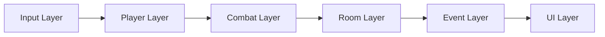

# Architecture Overview

## Input Layer
Desktop input actions (WASD, mouse aim, attack, interact, pause) are read once and forwarded to player/combat systems.

## Player Layer
Top-down player movement and facing apply input to locomotion, targeting, and state while keeping runtime attributes and saves in shared data systems.

## Combat Layer
Melee/ranged attacks resolve through hitbox-driven weapon logic and enemy damage interfaces, reusing shared damage, pooling, and VFX/audio pipelines.

## Room Layer
Room progression activates room combat, locks/unlocks doors, and advances floor state based on clear conditions and boss-room rules.

## Event Layer
Event channels remain the decoupling backbone for state transitions, enemy lifecycle, UI refresh, and audio requests.

## UI Layer
UI Toolkit hosts/views/controllers render HUD, menus, shop, and results, using shared factory + panel patterns documented in [Shared Systems](shared-systems.md).
